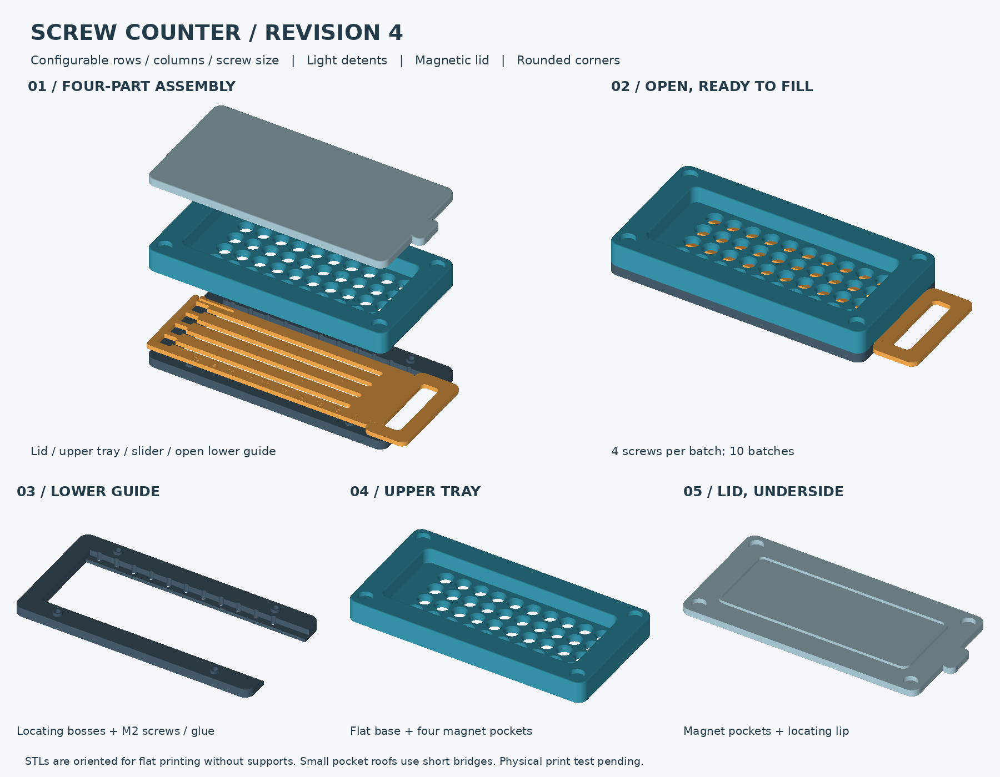
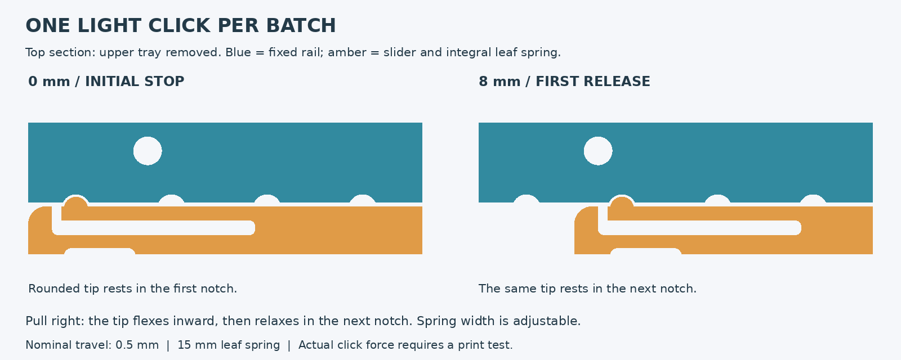

# Screw Counter Builder

ネジを決まった本数ずつ梱包するための、3Dプリント製計数トレーのCadQueryモデルです。
現在は **Revision 4**。標準はM2・4本×10列で、1列ごとに軽いクリックが掛かる構造です。



## セットアップ

Python 3.10以上を使用します。生成確認済みのCadQuery 2.7.0を固定しています。

```sh
python -m venv .venv
source .venv/bin/activate
python -m pip install -r requirements.txt
python design_screw_counter.py --rows 4 --columns 10 --screw M2 --out generated
```

`rows`は1回に排出する本数、`columns`は列数です。M1.5／M2／M3に対応しています。

```sh
# 小型の試験版
python design_screw_counter.py --columns 2 --out test
# クリックを弱める
python design_screw_counter.py --columns 2 --detent-spring-width 1.0 --out light_test
```

## ファイル

- [詳細な設定・印刷・組立説明](README_ja.md)
- `design_screw_counter.py`：パラメータ設定、CAD生成、幾何学的な検証
- `generated/`：標準M2・4×10の組立STEPと印刷用STL
- `test/`：4×2の印刷試験版（ソフトウェアのテストスイートではありません）
- `validation_matrix.json`：異なる設定で実施したCAD検証記録



CAD上の保持・通過・干渉は確認していますが、印刷・動作・クリック力・耐久性は未検証です。
まず試験版で確認してください。ばねが乗り越える弱いクリックのため、強く引くと複数列を通過します。
